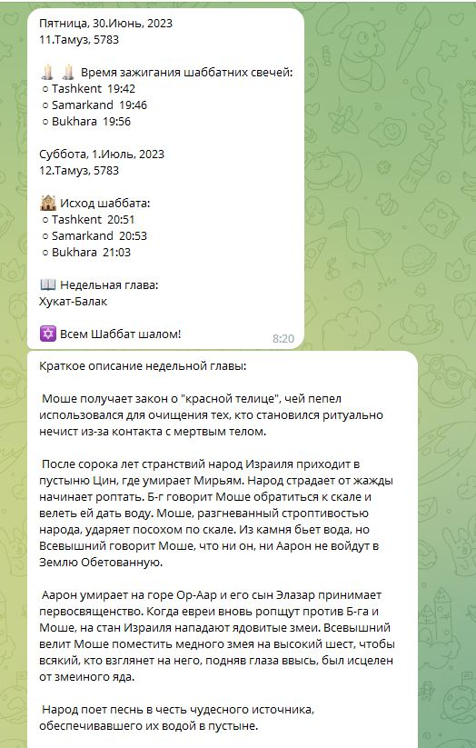
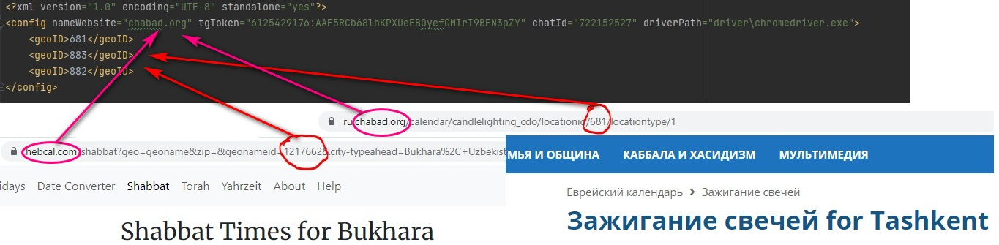

#  Shabbat bot
Этот Telegram бот, позволяет информировать о времени наступления и исхода Шаббата на Telegram каналах или группах в разрезе городов.
В качестве источника информации могут использоваться сайты chabad.org или hebcal.com.

Технические требования:
- OC: Windows;
- JDK 17  и выше;
- Браузер:  Google Chrome 114 (возможна замена на другую версию путём подбора соответствующего драйвера).
- Драйвер Google Chrome (с комплекте версия 114.0.5735.90. Возможно установить любую другую версию с сайта https://chromedriver.chromium.org/downloads).

Конфигурация:
Настройка производится в конфигурационном файле config.xml
- nameWebsite: имя веб сайта источника информации (chabad.org или hebcal.com);
- tgToken:  токен Telegram бота;
- chatId: ID группы, или канала откуда будет осуществляться рассылка сообщений (бот должен быть добавлен в эту группу или канал). Возможно использовать несколько ID чатов, указав их через запятую. Например: "4556774,34455677";
- driverPath: Путь\имя драйвера Google Chrome
- geoID: Список id городов, которые будут присутствовать в рассылке. 
Обратите внимание, что ID городов на сайтах chabad.org и hebcal.com разные!

Запуск:
java -jar shabbat_bot.jar